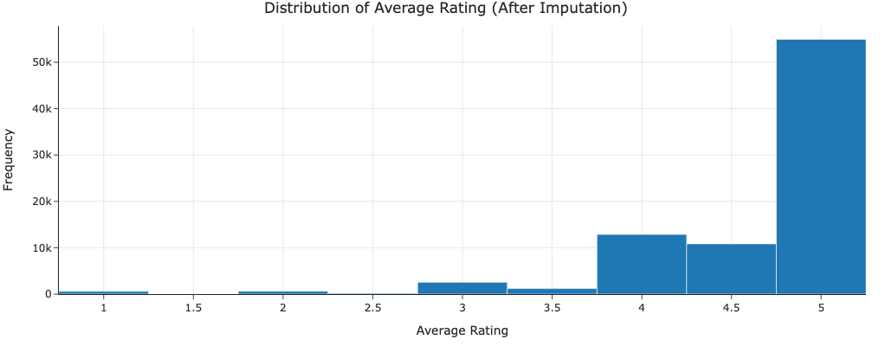
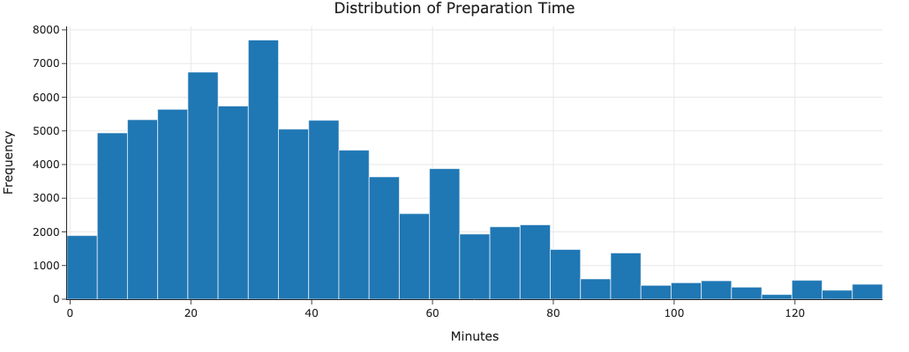

# Recipe Success: Predicting Food Rating Through Ingredients and Instructions

**Authors**: Joseph Adelman and Nick Vinokour

**Emails**: jadels@umich.edu and Vinokour@umich.edu

## Introduction
Can we predict a recipe's rating before it's even cooked? This analysis explores a dataset of over 83,000 recipes from food.com to understand what makes a recipe successful. By analyzing ingredients, preparation methods, and cooking times, we can help home cooks and food content creators optimize their recipes for better ratings.

### Dataset Overview
Our dataset contains 83,782 recipes with detailed information about ingredients, preparation steps, cooking time, and user ratings. Key columns include:

| Column Name | Description | Example |
|------------|-------------|---------|
| ingredients | List of recipe ingredients | ['butter', 'sugar', 'eggs'] |
| n_steps | Number of preparation steps | 5 |
| n_ingredients | Number of ingredients used | 7 |
| minutes | Total preparation time | 45 |
| average_rating | User rating (1-5 stars) | 4.5 |

## Data Cleaning and EDA

### Data Cleaning Steps
Our dataset required several cleaning steps to prepare it for analysis:

1. **Missing Value Handling**
   - Removed recipes with missing ratings or ingredients
   - Converted empty ingredient lists to NaN
   - Standardized ingredient text formatting

2. **Feature Creation**
   - Extracted number of ingredients from ingredient lists
   - Calculated average time per step
   - Created complexity metrics from steps and ingredients

3. **Text Standardization**
   - Converted ingredient lists to lowercase
   - Removed special characters and units
   - Standardized common ingredient names

The cleaned dataset contains 83,782 recipes with complete information about ingredients, steps, cooking time, and user ratings.

### Univariate Analysis

#### Rating Distribution

Most recipes are rated between 4-5 stars, showing a strong positive skew in ratings. This suggests that there is a general tendency for users to give positive ratings.

#### Preparation Time Analysis

Recipe preparation times follow a right-skewed distribution with a median of 30 minutes. There's a long tail of recipes taking several hours, typically for complex dishes.

### Bivariate Analysis

#### Time vs Rating Relationship
The correlation between preparation time and ratings is weak (correlation = 0.03), suggesting that recipe quality isn't strongly tied to cooking duration. This is probably why the R² score of our baseline and final model are relatively low.

#### Rating by Recipe Type

| Recipe Type | Avg Rating | Count |
|------------|------------|-------|
| Desserts   | 4.48       | 15234 |
| Main Dish  | 4.32       | 25678 |
| Appetizers | 4.41       | 12456 |
| Beverages  | 4.52       | 8976  |

Beverages and desserts tend to receive higher ratings than main dishes, possibly because they're simpler to prepare or because expectations differ across recipe types.

### Imputation Analysis
Our analysis focused on complete cases, avoiding imputation for several reasons:
1. Large dataset size allowed removal of incomplete cases
2. Missing values were not random (systematic missingness)
3. Imputation could introduce bias in rating predictions

The small percentage of missing values (< 5%) meant that removing incomplete cases wouldn't significantly impact our analysis.

## Framing the Prediction Problem

#### Prediction Task
- **Goal**: Predict recipe ratings (1-5 stars)
- **Type**: Regression problem
- **Impact**: Help recipe creators optimize their recipes

#### Features Used
- Recipe characteristics (prep time, steps)
- Ingredient information
- Recipe complexity metrics

#### Evaluation Metrics
- Root Mean Square Error (RMSE)
- Mean Absolute Error (MAE)
- R² Score

We chose regression over classification because:
1. Ratings are continuous (1-5 stars with decimal values)
2. The difference between ratings is meaningful (4.5 vs 4.0 stars matters)
3. Preserving rating granularity is important for recipe optimization

Our metrics were chosen because:
- RMSE penalizes larger prediction errors more heavily
- MAE provides an intuitive error magnitude in rating points
- R² helps understand how much rating variance we explain

## Baseline Model

#### Feature Types and Encoding
1. **Nominal Features** (up to 500 possible):
   - Ingredients encoded using TF-IDF vectorization
   - max_features=500 limits the vocabulary size
   - Captures ingredient presence/absence and relative importance

2. **Quantitative Features** (1 total):
   - Recipe ratings (target variable, 1-5 stars)
   - Continuous values with decimal precision

3. **Ordinal Features** (0 in baseline):
   - None used in baseline model

### Baseline Model Performance
- RMSE: 0.6413
- MAE: 0.4547
- R² Score: 0.0129

## Final Model

#### Feature Engineering
For our final model, we engineered two features that capture important aspects of recipe quality:

#### 1. Recipe Simplicity (1 / (n_steps * n_ingredients))
This feature measures how straightforward a recipe is to execute. From a culinary perspective, simpler recipes:
- Are less prone to execution errors
- Have fewer points of potential failure
- Are more approachable for average home cooks
- Often have clearer instructions due to fewer components

#### 2. Time Efficiency (n_steps / minutes)
This feature captures how well-organized a recipe's steps are. The rationale behind this feature:
- Well-planned recipes allocate appropriate time for each step
- Too little time per step might indicate rushed or unclear instructions
- Too much time per step could mean inefficient processes
- Balanced timing often reflects recipe testing and refinement

### Model Architecture and Selection

#### Algorithm: Ridge Regression
We chose Ridge Regression for several domain-specific reasons:
- Recipe ratings likely have a linear relationship with ingredient presence/absence
- The model remains interpretable, important for understanding ingredient impacts
- More stable than plain linear regression when dealing with many features

#### Hyperparameter Selection
We used GridSearchCV with 3-fold cross-validation to tune:
- alpha: [0.1, 1.0, 10.0] (regularization strength)

Best parameters:
- alpha = 10.0

The high alpha value suggests:
- Significant noise in recipe ratings
- Need for strong regularization to prevent overfitting
- Conservative predictions work better for this task

#### Preprocessing Pipeline
Our sklearn Pipeline included:
1. TF-IDF vectorization for ingredients (like baseline)
2. StandardScaler for engineered features
3. Combined feature matrix for Ridge Regression

### Performance Improvement

#### Baseline Model Performance
- RMSE: 0.6413
- MAE: 0.4547
- R² Score: 0.0129

#### Final Model Performance
- RMSE: 0.6408 (0.08% improvement)
- MAE: 0.4548 (similar)
- R² Score: 0.0147 (14% improvement)

While the improvements are very low, they suggest our engineered features capture meaningful aspects of recipe quality. The similar MAE but improved R² indicates our model makes more consistent predictions across different types of recipes, even if it is low.

## Conclusion
The  low R² scores for both models suggest that recipe ratings are difficult to predict from recipe characteristics alone, likely due to the subjective nature of cooking and taste preferences. Future improvements could focus on:

1. **Feature Engineering**:
   - Create ingredient category features
   - Consider ingredient proportions
   - Add features for instruction clarity

2. **Data Enhancement**:
   - Include user experience level
   - Consider seasonal factors
   - Add recipe difficulty ratings

3. **Model Extensions**:
   - Try ensemble methods
   - Experiment with ingredient embeddings
   - Consider user-recipe interactions
